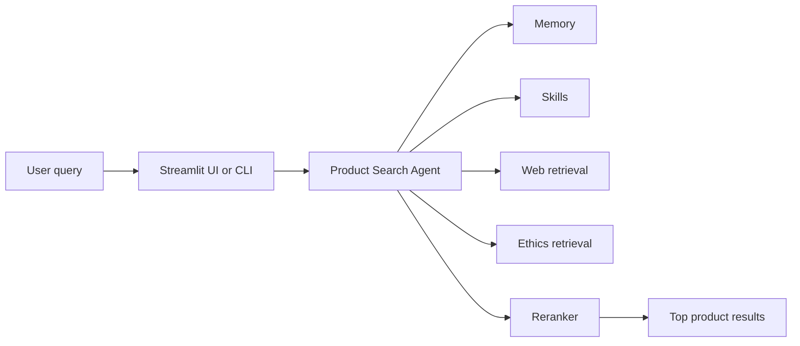
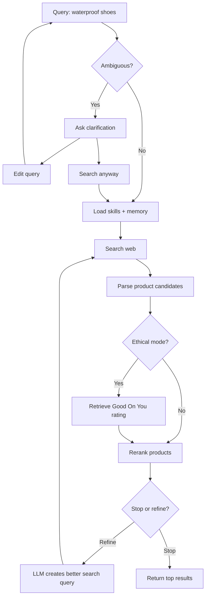
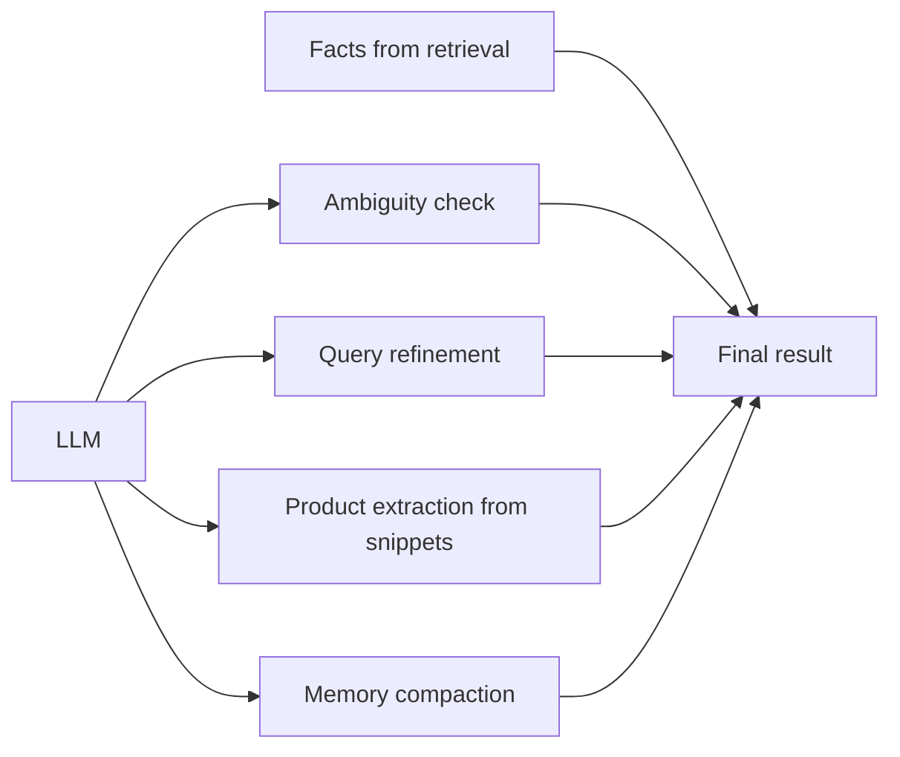
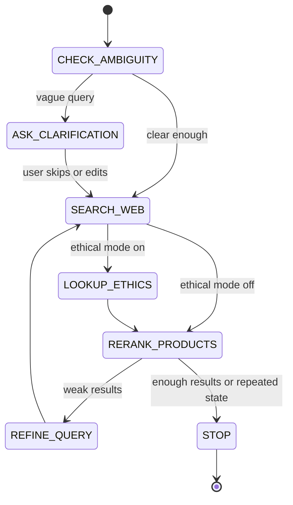
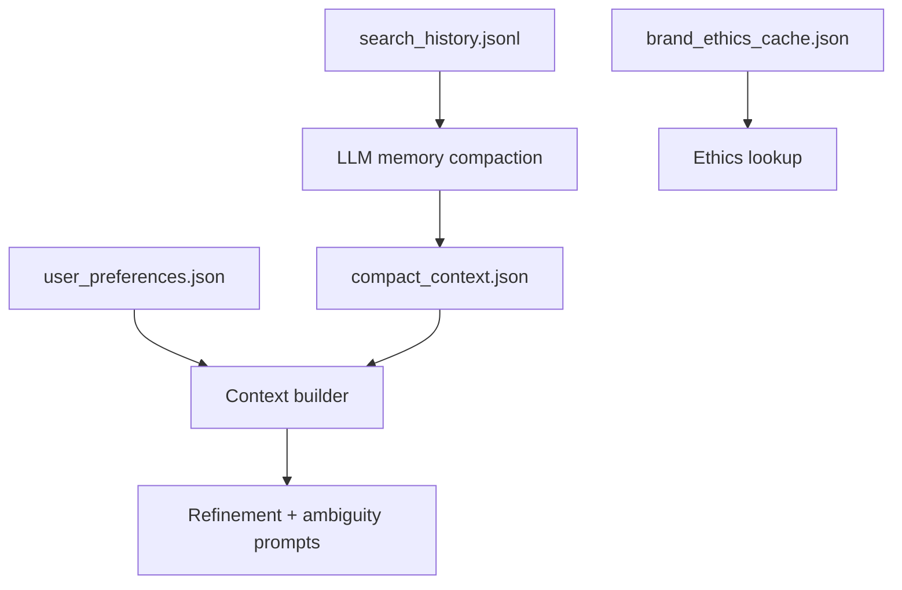
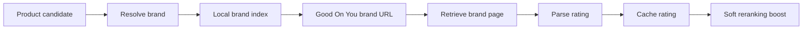
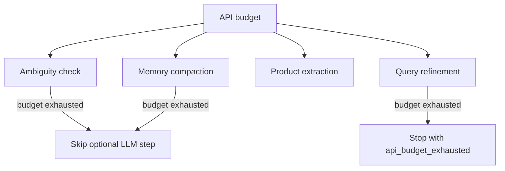
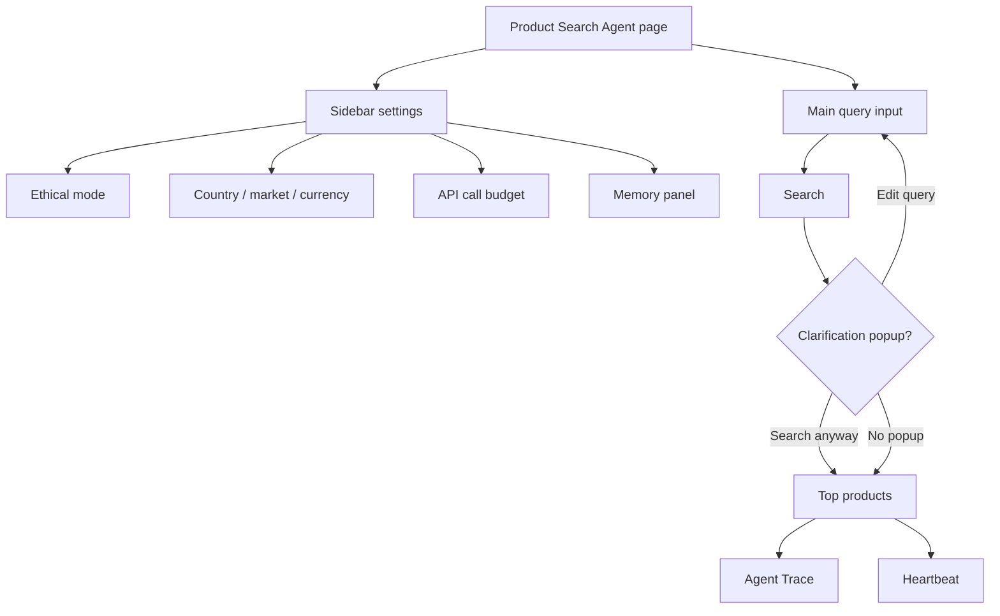
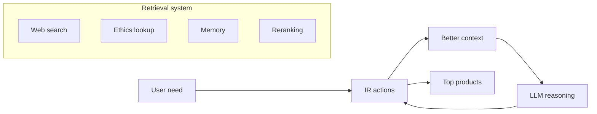

## Product Search Agent (+ ethical rating from Good on You)

HuggingFace Space: https://huggingface.co/spaces/andreiaalexa/product-search-agent-ethical-rating

Video walkthrough: https://drive.google.com/file/d/1PEkEINxOjBgmkoqh0_Fkmzdw8WWw7i82/view?usp=sharing 

## 1. The Big Picture



The agent is not just a chatbot. It is a small retrieval system wrapped in an
agent loop. It searches, checks context, improves the query, retrieves again
when needed, and returns ranked products.

## 2. What Happens When You Search



The agent can pause before retrieval if the query is too vague. In the UI, this
appears as a popup with two choices:

- **Edit query**: go back and make the query clearer.
- **Search anyway**: skip clarification and retrieve with the original query.

## 3. Where The LLM Is Used



The LLM is used as a controller and context engineer. It helps the agent decide
how to search better, but it should not invent facts.

Good LLM uses in this project:

- Decide whether a query is too ambiguous.
- Rewrite a weak search query into a better retrieval query.
- Extract structured products from search result snippets.
- Compact past searches into useful memory.

Things the LLM should not decide:

- Good On You ratings.
- Whether a brand exists in Good On You.
- Product prices or availability.
- Source URLs.

Those facts must come from retrieval.

## 4. Information Retrieval Actions



The agent uses actions as retrieval steps:

| Action | Purpose |
| --- | --- |
| `ASK_CLARIFICATION` | Stop early if the query is too vague. |
| `SEARCH_WEB` | Retrieve real product candidates from the live web. |
| `LOOKUP_ETHICS` | Retrieve Good On You brand ratings when ethical mode is on. |
| `REFINE_QUERY` | Improve the retrieval query based on current context. |
| `RERANK_PRODUCTS` | Sort and deduplicate candidates. |
| `STOP` | Stop when results are good enough, budget is exhausted, or the state repeats. |

## 5. Memory System



The memory system has three jobs:

- **Search history** keeps a log of past runs.
- **Compacted memory** summarizes useful patterns from past searches.
- **Ethics cache** avoids retrieving the same Good On You brand page repeatedly.

Example compact memory:

```json
{
  "summary": "The user often searches for outdoor products in Sweden with SEK prices.",
  "retrieval_preferences": [
    "Prefer Swedish or EU product pages when country is Sweden.",
    "Prefer product pages over generic category pages."
  ],
  "avoid": [
    "Do not treat blog roundups as product pages unless they name concrete products."
  ]
}
```

## 6. Ethical Mode



Ethical mode does not remove products. It keeps all products and adds brand
rating context when available.

Important rule:

> The agent does not infer Good On You ratings with the LLM.

The rating must come from the retrieved Good On You brand page. If the brand is
not found, the agent says it is not rated instead of guessing.

## 7. API Budget



The API budget makes demos safer. If the budget is low, the agent still tries
to continue with deterministic fallbacks where possible.

Example:

```bash
python main.py "waterproof hiking shoes under 1500 SEK" \
  --model "google/gemma-4-31B-it" \
  --country Sweden \
  --market se-sv \
  --currency SEK \
  --max-api-calls 3
```

## 8. UI Walkthrough



The Streamlit page is designed for demonstrating the agent:

- The main input is the only query input.
- Ambiguous searches open a popup instead of adding another text field.
- The sidebar controls retrieval behavior.
- The agent trace shows what actions were taken.
- The heartbeat shows the latest run status.

## 9. Example Demo Script

Use this for a short presentation.

1. Start the UI:

```bash
streamlit run app.py
```

2. Try an ambiguous query:

```text
waterproof shoes
```

Show that the agent asks for clarification before retrieval.

3. Click **Search anyway**.

Show that the agent can continue even when the user skips the question.

4. Try a clearer localized query:

```text
waterproof hiking shoes under 1500 SEK
```

Show:

- Locale: Sweden / `se-sv` / SEK.
- Search queries used.
- Top ranked product candidates.
- Agent trace.

5. Turn on ethical mode and search:

```text
HOKA waterproof hiking shoes
```

Show:

- Brand resolution.
- Good On You source URL.
- Rating shown without filtering products out.

## 10. One-Slide Summary



The project shows how an AI agent can improve Information Retrieval by
combining live search, memory, query refinement, skills, ethical retrieval, and
state-based stopping.
